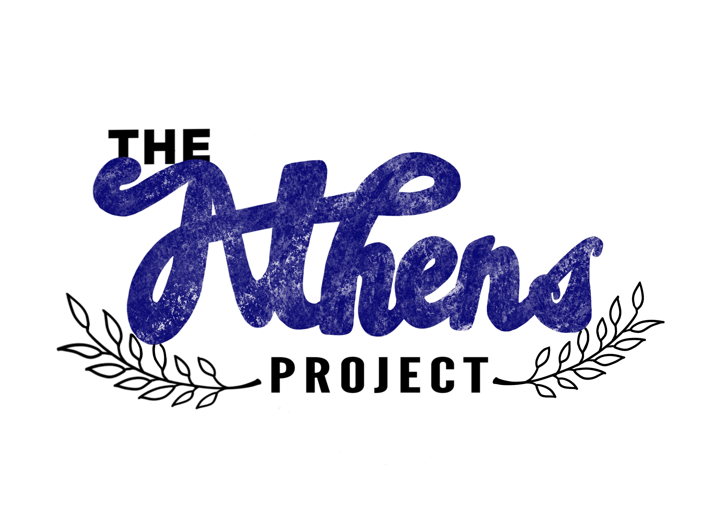
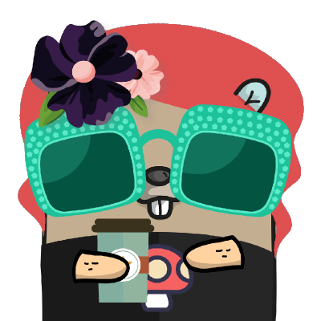

# Welcome Gophers!!! :tada: :smile:

This repository has outlines, materials and code for [Athens](https://docs.gomods.io) workshops.

There are also [slides](https://cda.ms/Kw) to go along with this workshop.

Let's get started!

## Abstract

Go dependency management has come a long way. When the language was first open sourced, there was very little support for versioned dependencies at all.

Since then, we've seen several technologies to do dependency management, and now we've made it to the new Go modules system. Modules are new in Go 1.11 and it's a brand new way to do dependency management system. Since it's built right into the `go` tool, we all have a standard way to fetch dependencies for our projects! _That's great news!! :tada:_

### More on Modules

We used to call our dependencies "packages," but now we use "modules." The name change is kind of nit-picky, but we do it because modules are different from packages:

- Modules are some code and a version
    - Notice that these don't have to be git?
    - They actually don't have to come from a version control system (VCS) at all!
    - But almost all of them still will :grinning:
- Packages are a git repository and a commit SHA or tag

Fetching modules is a simple `go get` away, and there are two new files - `go.mod` and `go.sum` - that `go get` (and `go build`, `go install` and friends) all use. 

You can check these files in with your project, and anyone else who comes along and runs `go build` will build your project with exactly the same code as you did.

And you can do that all without an external dependency manager like `dep`, `glide`, `godep`, or anything else. We didn't have that before, and that's pretty cool!

## So What Are We Doing Today?

We'll learn all about modules, and then do a hands-on coding session where we use modules to build a real Go project - [Hugo](https://github.com/gohugoio/hugo).

Then, we'll dive into another exciting technology that comes with modules in Go 1.11, called module proxies. These proxies make working with modules even simpler, faster and more reliable.

We'll learn about proxies and get familiar with the Athens project - a community-built proxy. We'll finish up with a hands-on coding session where we integrate the Athens proxy into the project we used before.

## What Will I Learn?

You'll walk away from this workshop knowing:

- How to do proper dependency management for Go projects
- What to expect with modules
- How to integrate them with your projects
- Why module proxies matter and what they can do for you
- What Athens is and how to integrate it with your project
- How to get involved with Athens

## Ready To Get Started?

Go check out the [outline](./OUTLINE.md). It has all the steps and links to all the workshops. Join me for an emoji-filled journey! :rocket:

